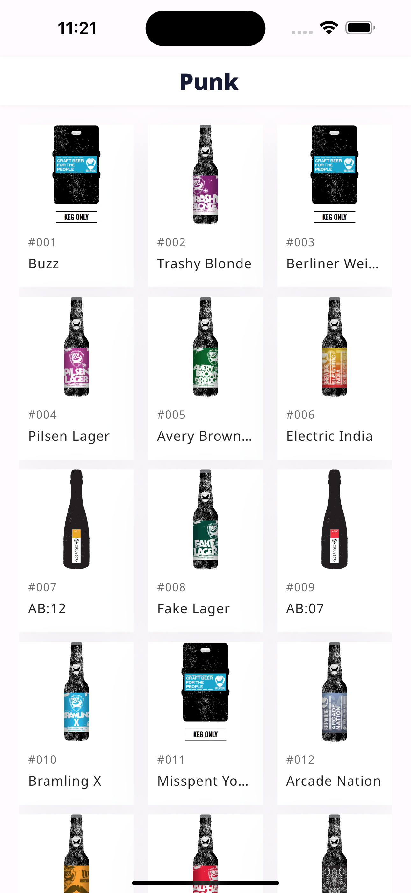
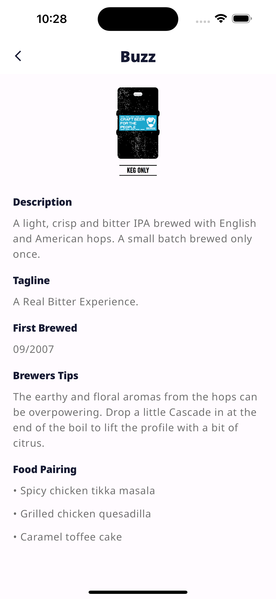

# Punk App

This Punk App is built with Flutter and uses both clean architecture, and stacked (MVVM) architecture.

Punk is a mobile app that allows interacting with beers

<br>

## Features

- Used dio package to handle all network calls.
- Used flutter clean arcitecture to structure the codebase.
- Used stacked architecture to implement separation of concerns.
- Implement pagination with "Infinite Scroll" to fetch the next set of items when the user reaches the end of the list.
- Shows a snackbar whenever their is no internet connection.
- Displays a well defined error message whenever calls to the punk api throws an exception.
- Implement a retry button whenever calls to the punk api throws an exception e.g When there is no internet connection.
- Unit tests and widgets tests

<br>

Link to Punk API documentation : https://punkapi.com/documentation/v2

<br>

## Screenshots

### Splash


### Home & Punk Details

&nbsp;&nbsp;&nbsp;&nbsp;&nbsp;&nbsp;&nbsp;&nbsp;

### Home Screen with an error message and a retry button

&nbsp;&nbsp;&nbsp;&nbsp;&nbsp;&nbsp;&nbsp;&nbsp;


## ✨ Requirements

- Any Operating System (ie. MacOS X, Linux, Windows)
- Any IDE with Flutter SDK installed (ie. Android Studio, VSCode, IntelliJ, etc)
- A little knowledge of Dart and Flutter


## Run Locally

```bash
  git clone https://github.com/lexican/punk_app.git
  cd punk_app
  flutter pub get
  flutter run
```
## To run test

```bash
  git clone https://github.com/lexican/punk_app.git
  cd punk_app
  flutter pub get
  flutter test
```


